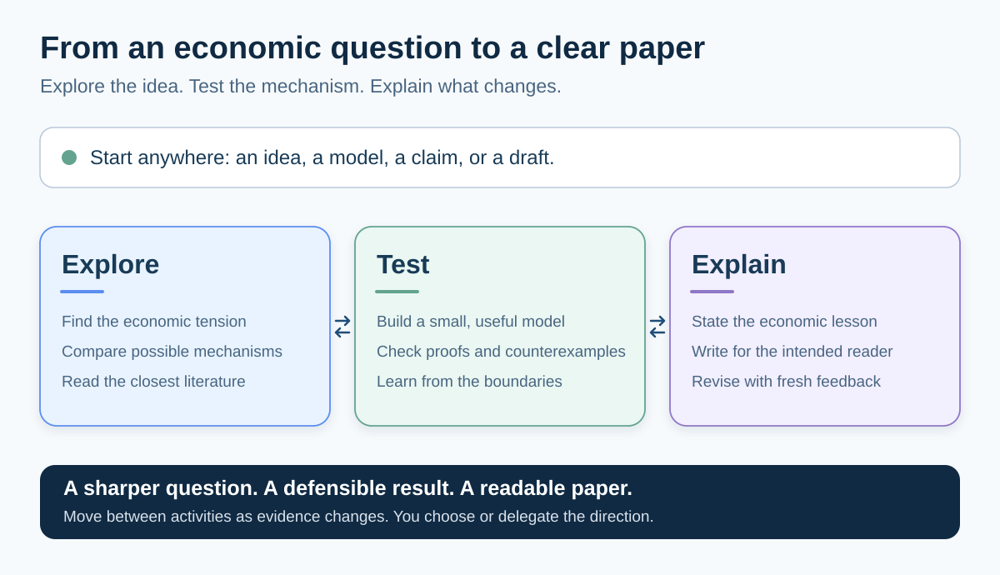
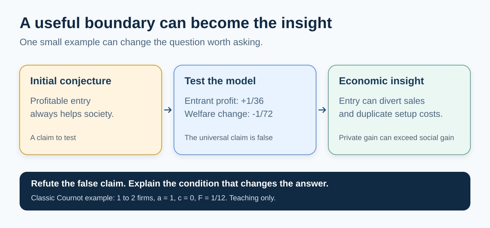

# Econ Theorist AI

**Turn an economic question into a clear, well-supported theory paper.**

An AI-assisted research workflow for microeconomic theory and IO. Bring an idea,
a model, a theorem, or a draft; develop the economics, check the reasoning, and
explain what the reader learns.



## Start in three steps

1. Download this repository or clone it.
2. [Copy the workflow into your paper folder](INSTALL.md).
3. Open that folder in your AI coding assistant and describe the task:

```text
Use the system: initialize this paper project.
Use the system: continue by the system.
Use the system: quickly screen this idea.
Use the system: run a full literature audit.
按系统继续：先解释这个机制为什么值得研究。
```

You can speak Chinese or English. Research notes and manuscripts are English
by default, unless you request another language. Your agent environment provides
the model and tools; configure software only when a particular check needs it.

## What the research should produce

A worthwhile question, a mechanism you can explain, claims with evidence,
and a paper an economist can follow. An unexpected result can reveal a useful
boundary and a better question.



The [worked example](examples/cournot_entry.md) shows the model, hand proof,
economic explanation, and source. It reconstructs a classic result for teaching.
Methodological theory is welcome too: explain what the new method lets us understand.

## Familiar commands, a simpler workflow

The usual commands and seven protocol filenames are retained. The AI reads the
relevant material, records what changed, and continues within your instructions.
You choose or delegate the research direction.

This update removes fixed candidate quotas, repeated approval stops, and rigid
stage sequences. Old internal stage commands, generated filenames, and some
tool-check behavior have changed. For an existing project, follow the
[upgrade and rollback guide](docs/MIGRATION.md) once; keep your papers and evidence.

<details>
<summary>Methods, tools, and verification</summary>

- Methods: [Discovery](ECONOMETRICA_DISCOVERY_WORKFLOW.md),
  [Verification](ECONOMETRICA_VERIFICATION_WORKFLOW.md),
  [Writing](ECONOMETRICA_AI_HUMAN_WORKFLOW.md),
  [Independent review](ECONOMETRICA_PANEL_PROTOCOL.md).
- Getting started: [First run](FIRST_RUN.md) and [optional tools](TOOLCHAIN_README.md).
- Maintaining the workflow: [Design and sources](docs/DESIGN_NOTES.md),
  [evaluation cases](evals/behavior_cases.md), and [contributing](CONTRIBUTING.md).

Proofs, citations, and computation must support the claims made. Shorter prompts
and simulated reviews do not establish top-journal quality; research quality
still needs substantive evaluation.

</details>

Modified for the original workflow refresh, 2026-09-14. Not affiliated with Econometrica.
Licensed under [Apache 2.0](LICENSE). If useful, [cite the project](CITATION.cff).
